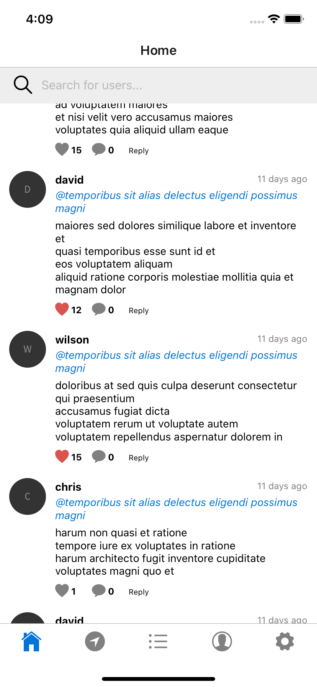
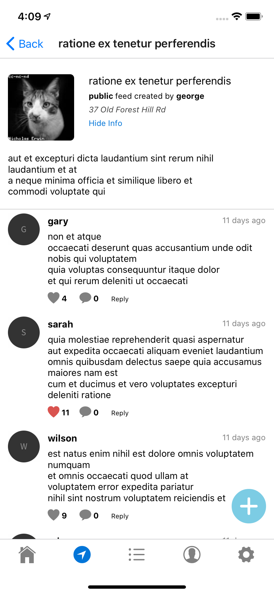
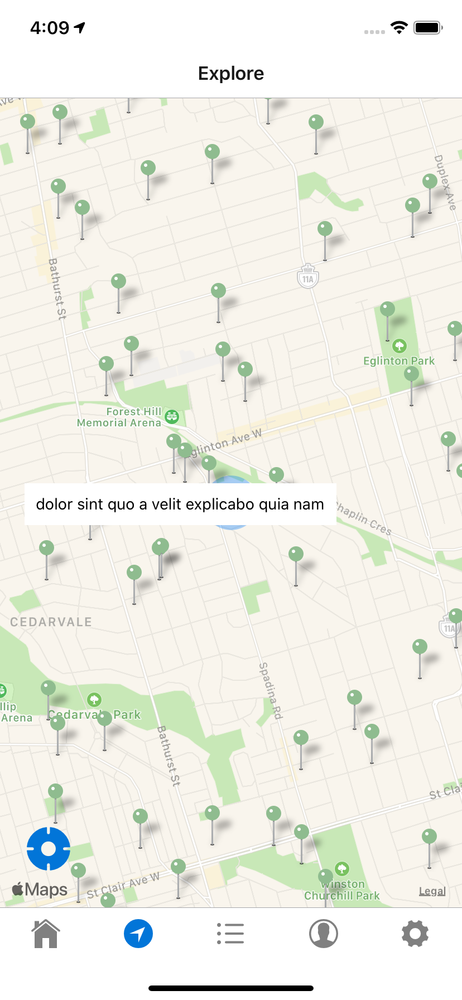
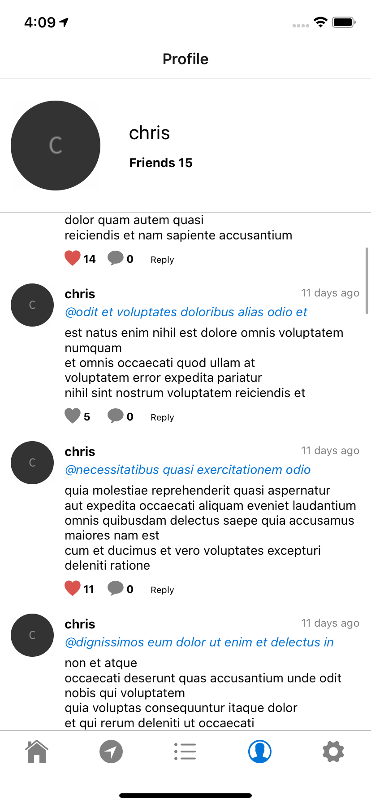

# Event-io

A social media iOS and Android application built with React-Native. Event-io allow users to create localized event feeds to which others can post, like, and share their activities.

### Environment

1. Event-io makes use of the Mapquest's Geocoding API. You will need to visit their website at https://developer.mapquest.com to sign up and recieve an API key.

2. Create a .env file inside the server directory. Inside you will need to provide two values, the mapquest API key and the JSON web token key (this can be any value). Format the values as such:

   `MAPQUEST_KEY=YOUR_MAPQUEST_API_KEY`  
   `API_KEY=YOUR_API_KEY`

### Installation

1. Install Node.js [here](http://nodejs.org) and mongodb from [here](https://mongodb.com)
2. Install react-native and yarn globally by running the command `npm install react-native yarn -g` from your command line.
3. Navigate to the server folder and install dependencies by running `npm install` from the command line.
4. Navigate to the client folder and install dependencies by running `yarn install` from the command line.
5. **iOS ONLY**: Navigate to ios folder located in _client/ios_ and install dependencies by running `pod install` from the command line.
6. Navigate to client folder and run `yarn start` from the command line. This will begin the development server.
7. Navigate to the server folder and begin the server by running the command `node server.js` from the command line.

### Emulation

- To begin emulation on your desired platform, make sure you are in the client folder and execute the command `yarn run ios` or `yarn run android` from the command line.

- You may wish to seed the database. Simply run `npm run seed` from the server directory to accomplish this.

  
  
  
  

